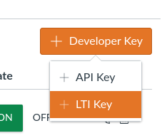
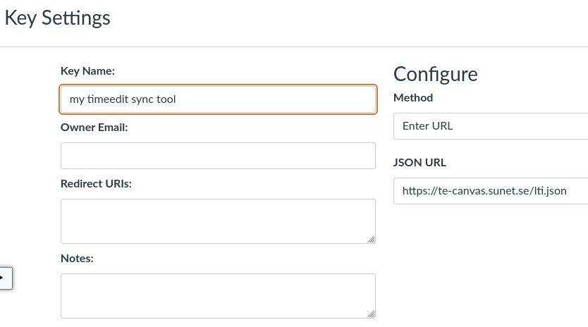
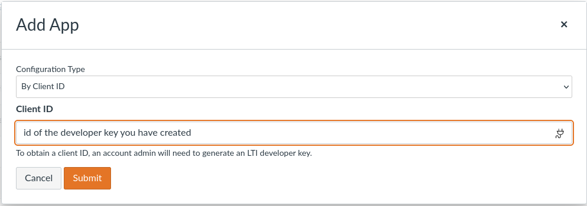
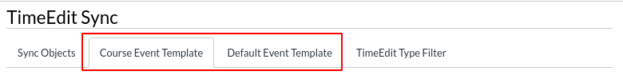
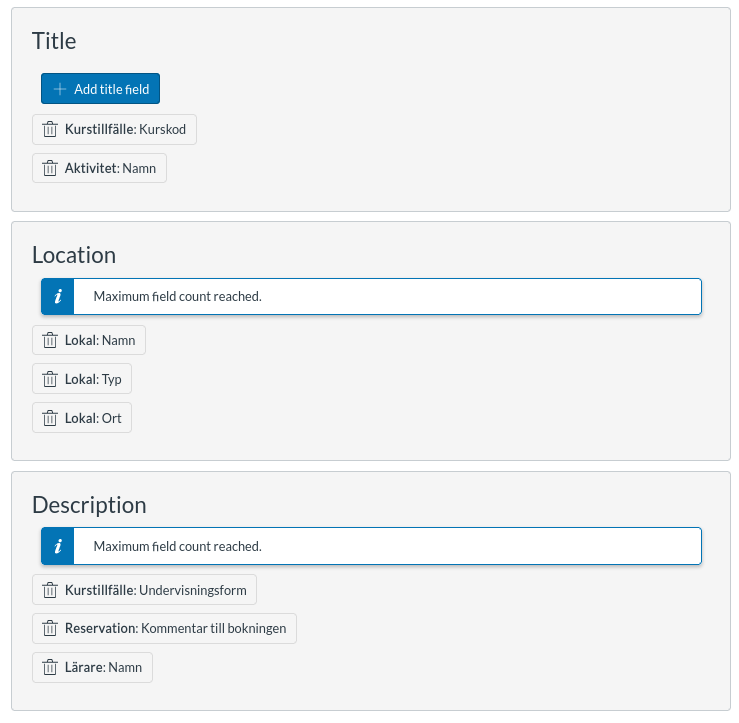

_Documentation for Canvas admins_

# Installing te-canvas as an LTI tool

1. Go to: Admin > Developer Keys > [+ Developer Key] > [+ LTI Key]  
   
2. Choose method: "Enter URL", and enter:

   - JSON URL: https://te-canvas.sunet.se/lti.json
   - Key Name: te-canvas (or whatever you like)

   

3. Under "State" click "ON"
4. Copy the Client ID number which is visible in the column "Details". Note that this is the string which is shown above the button "Show Key", _not_ the string you get if you click this button.
5. Email the Client ID to the person at Sunet who is helping you set this up. To complete the installation we will also need:
   - URL of your Canvas and TimeEdit instances
   - API key for Canvas
   - Read-only API access to TimeEdit. We need username, password, and SOAP API certificate for TimeEdit
6. Once you have received a reply that the server has been updated with your information you can activate the app. To activate te-canvas on a specific course:

   - Go to Course > Settings > Apps > [View App Configurations] > [+ App]
   - Choose "By Client ID" and paste the Client ID from step 4, click Submit.

   

# Event templates

In the UI you will find two tab called "Course Event Template" and "Default Event Template". In these tabs you can configure how calendar events are translated from TimeEdit to Canvas. Each section – Title, Location, and Description – should be configured with the desired TimeEdit _object types_ and their _fields_.

## Default Event Template

This template will be used for all courses which have not configured an event template. Only Canvas administrators can update this template.

## Course Event Template

This template will control how events are translated for a single course. Canvas administrators and teachers can update this template.

## Valid Event Template

A valid event template must have atleast one field added to each Canvas event section: Title, Location and Description. If there is no valid event, syncing will be suspended. This an example of a valid Event Template. Note that the maximum number of fields is 3.

